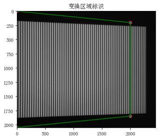
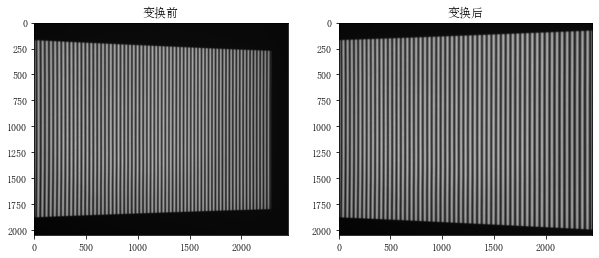

## python OpenCV 图像透射变换

*Perspective Transformation*

*cv2.getPerspectiveTransform()*

张课题仿真中需要判断, 拍照引起的投射变换, 是否是导致正弦条纹图像FFT的中点线出现杂波的原因.

尝试使用OpenCV完成图像透射变换操作.

**具体步骤如下**
>
1. 读取图像
2. 确定需要透射的区域(4个顶点)
3. 联立4个顶点和原始有效区域的四个顶点解`转移矩阵`
4. 对原始有效区域使用变换矩阵, 得到结果


[参考博客](http://www.1zlab.com/wiki/python-opencv-tutorial/opencv-image-prespective-projection/)

[官方文档](https://docs.opencv.org/3.0-beta/doc/py_tutorials/py_imgproc/py_geometric_transformations/py_geometric_transformations.html#geometric-transformations)

-----------------------
举一个简单的例子


```python
import cv2
import numpy as np
import matplotlib.pyplot as plt

image = cv2.imread("1.bmp")

# 透视图像
rows, cols = image.shape[:2]

# 原图像素坐标
pts1 = np.float32([[0, 0], 
                    [0, rows-1],
                    [2000, 200],
                    [2000, rows-200]])

# 目标像素坐标
pts2 = np.float32([[0, 0], 
                    [0, rows-1],
                    [cols-1, 0],
                    [cols-1, rows-1]])

matrix = cv2.getPerspectiveTransform(pts1, pts2)
perspectiving_image = cv2.warpPerspective(image, matrix, (cols, rows))


# 显示图像
plt.figure('Area Mark', figsize=(5, 10))
plt.title('变换区域标识')
plt.imshow(image)
plt.scatter([0, 0, 2000, 2000], [0, rows-1, 200, rows-200], edgecolors='r')
plt.plot([0, 2000, 2000, 0], [0, 200, rows-200, rows-1], 'g')

plt.figure('Image Display', figsize=(10,10))
plt.subplot(121)
plt.imshow(image)
plt.title('变换前')
plt.subplot(122)
plt.imshow(perspectiving_image)
plt.title('变换后')
plt.show()
```


    

    


    

    


总体上,
`cv2.getPerspectiveTransform` 求解了变换矩阵;

`cv2.warpPerspective` 进行了变换操作.

但美中不足的是, 这里是针对单幅图像的变换, 像素点需要自己选取, 对于不同size的图像, 并不充分适用.


但具体的通用旋转角度公式, 就像iphone相册里面的编辑方法一样的那种, 我想了半小时没有想出来, 力有所未逮, 可能需要参考文献.
