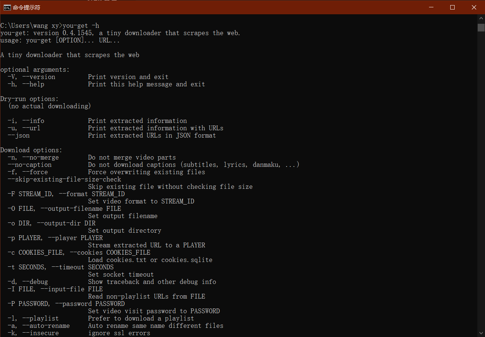
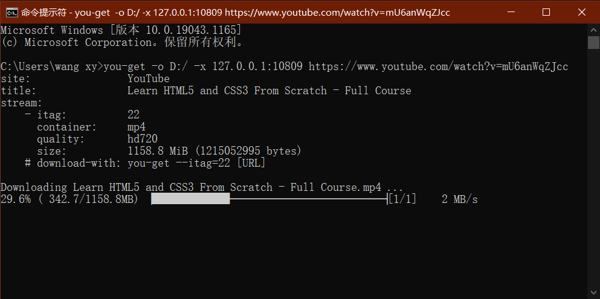
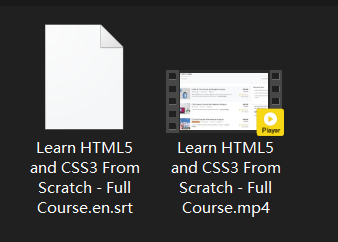

## you-get 使用

最近在学HTML5和CSS3入门, 发现YouTube上面的教程很不错, 门类和风格也各异. 决定照着学习, 但是文件时常很长, 不易拖动进度条, 学了一段, 打算下载下来在本地学习.


[官方文档](https://you-get.org/)

[参考博客](https://www.bilibili.com/read/cv1269125)

还是熟练地安装了之前用过的`you-get`. 

```commandline
pip3 install you-get
```

装好之后, 可以看到 you-get 的使用帮助

```commandline
you-get -h
```


1. 开始总是网络有问题, 然后下载了bilibili的视频, 发现可以下载, 那应该就是代理的问题.
2. 没有仔细看官方文档, 摸索了好一阵, 在参考博客中找到了如何使用代理
3. 敲入命令行, 开始下载

```commandline
you-get -o D:/ -x 127.0.0.1:10809 https://www.youtube.com/watch?v=mU6anWqZJcc
```



--------------------------

可以看到下载好的文件是包含字幕的, 直接在potplay中播放即可.



### you-get优点
- 性能强大, 可以下载很多网站的视频, 图片, 文件等等. 包括大量的中文网站
- 小巧轻便, 几乎不占用空间
- 有很多可选项, 包括代理

> 更多的使用技巧, 包括下载不同版本的视频, 使用ffmpeg融合高清视频和音频等, 可以进一步参考其他博客.