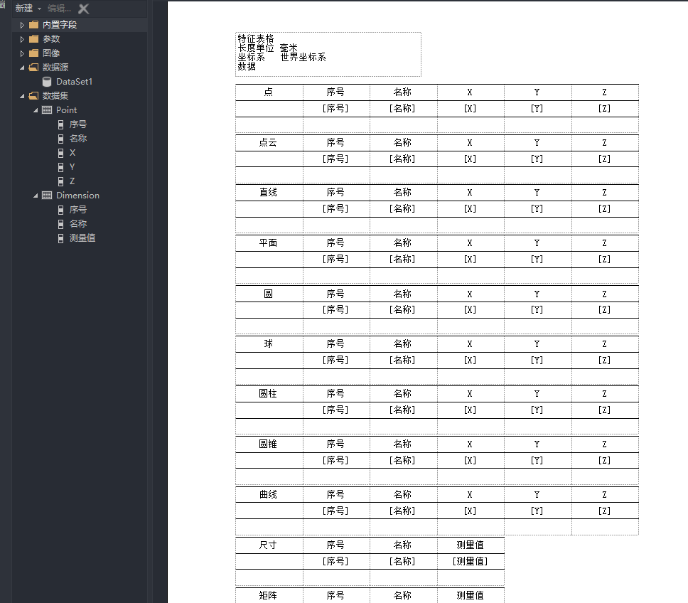
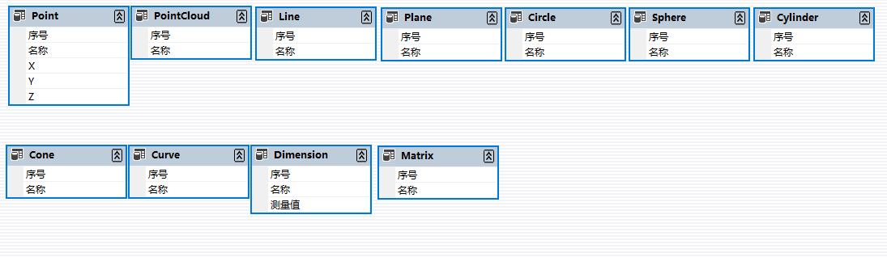
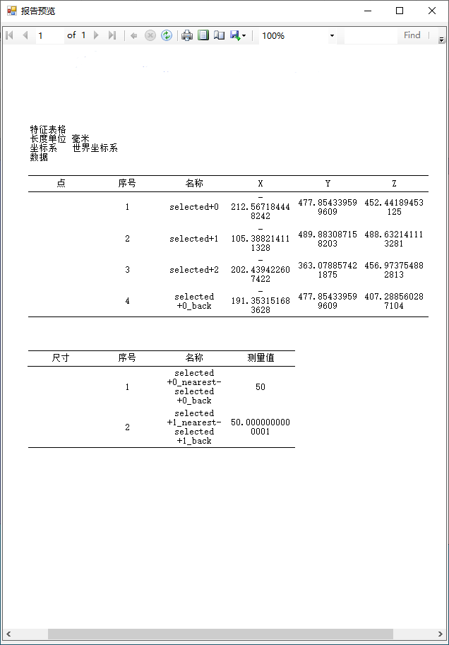

# 利用ReportViewer实现报表数据传递和可见性设置

一些ReportViewer的快速入门教程

1. [控件及工具安装 VS2019添加微软ReportViewer](https://www.cnblogs.com/springsnow/p/13498084.html)
2. [表格设计及显示快速教程(en)](https://www.c-sharpcorner.com/article/building-reports-from-a-dataset-using-reportviewer/)
3. [RDLC详细教程(en)](https://www.c-sharpcorner.com/UploadFile/2f59d0/working-on-rdlc-report-in-Asp-Net/)
4. [表格设计及数据静态绑定, 动态传入 C# 实现reportview的操作](https://blog.csdn.net/xufengab/article/details/123416231)
5. [表格属性动态设置(参数式) RDLC动态设置字体及颜色实例](https://blog.csdn.net/llwzjf/article/details/93978846)
6. [动态生成RDLC并绑定(未能复现)](https://blog.csdn.net/chenep/article/details/10552743)


## 1. 生成表格设计文件`.rdlc`
安装ReportViewer库, 并新建表格设计文件, 如下所示.


## 2. 新增本地数据集`DataSet`和参量`Parameters`
新建c#的数据集文件`.xsd`, 新增若干DataTable, 并添加相应字段.


在表格设计文件中数据集并添加, 可以找到`.xsd`文件及其中的相应DataTable, 将字段关联到具体的表格, 表格中呈现 `[XX]` 状态, 则说明绑定成功.

## 3. 动态绑定参数

可以在form界面通过调用`LocalReport.SetParameters`设定参数, 通过`LocalReport.DataSources.Add`绑定数据集.

```csharp
public void Set_DataSet()
{

    this.reportViewer1.LocalReport.DataSources.Clear();
    // 是否遍历
    Dictionary<string, bool> visited = new Dictionary<string, bool>();
    visited.Add("Point", false);
    visited.Add("PointCloud", false);
    visited.Add("Line", false);
    visited.Add("Plane", false);
    visited.Add("Circle", false);
    visited.Add("Sphere", false);
    visited.Add("Cylinder", false);
    visited.Add("Cone", false);
    visited.Add("Curve", false);
    visited.Add("Dimension", false);
    visited.Add("Matrix", false);

    // 绑定数据
    for (int i = 0; i < this.ds.Tables.Count; i++)
    {
        var tempTable = this.ds.Tables[i];
        var tableName = tempTable.TableName;
        visited[tableName] = true;
        var rds = new ReportDataSource();
        rds.Name = tableName;
        rds.Value = tempTable;
        this.reportViewer1.LocalReport.DataSources.Add(rds);//这里的DataSetNew数据集的名称，而不是xsd文件名。
    }

    foreach(var param in this.paramDict.Keys)
    {
        var rpName = param + "_visible";
        var rp = new ReportParameter(rpName, this.paramDict[param].ToString().ToLower(), false);
        // 设置表格的可见性
        this.reportViewer1.LocalReport.SetParameters(rp);
        if (visited[param] == false)
        {
            visited[param] = true;
            var rds = new ReportDataSource();
            var tempTable = new DataTable();
            rds.Name = param;
            rds.Value = tempTable;
            // 空数据集也需要绑定
            this.reportViewer1.LocalReport.DataSources.Add(rds);
        }
    }

    this.reportViewer1.RefreshReport();
}
```

## 4. 结果展示和总结

最终的显示效果如下:




### 总结
- ReportViewer不如DevExpress的报表灵活, 而且功能太少, 几乎不可编辑.
- 比较简洁, 可以传入Parameters设定一些值.
- 基本功能够用了, 可以导出pdf, excel, word, 但本质上还是基于excel的, 因此word和pdf的效果不佳.