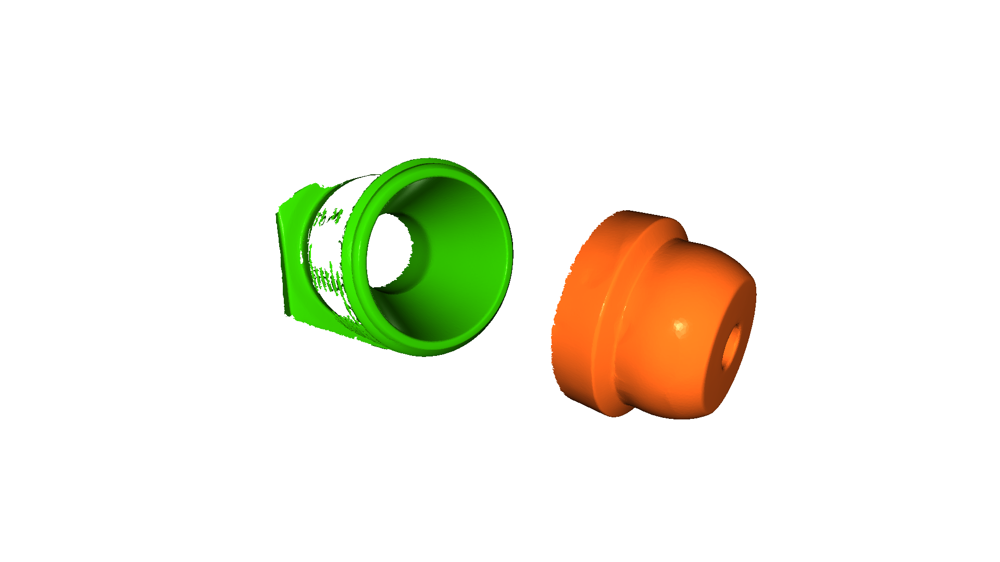
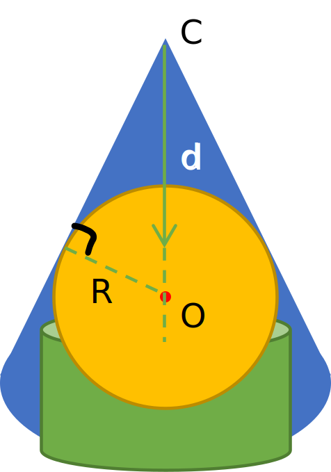
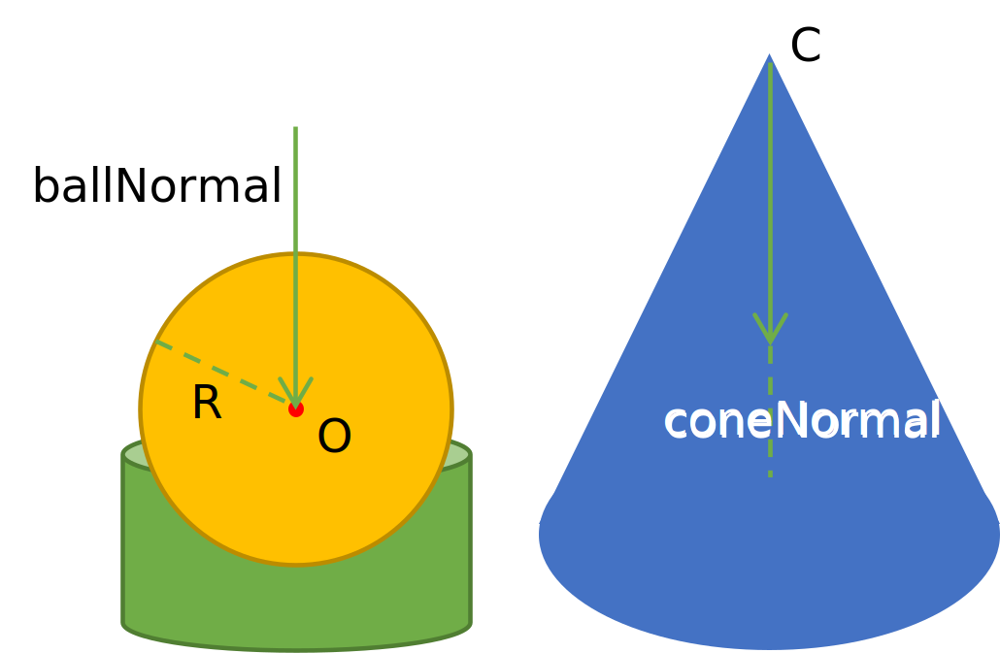
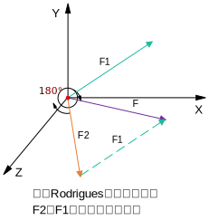
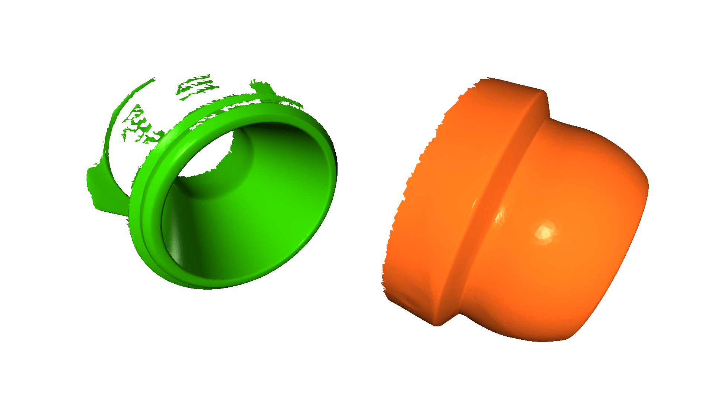
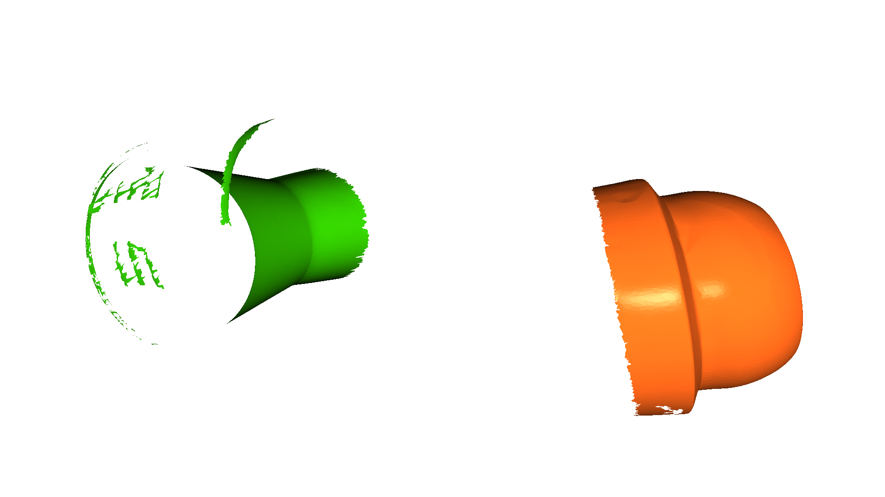
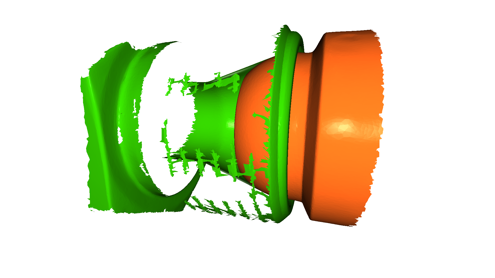

## 圆锥与球接触面计算 Rodrigues方法求解空间向量旋转矩阵

### 0. 问题描述
有一个连接器的两端需要计算对接偏差, 使用Gom三维扫描仪重建得到了对应的`stl`文件, 但是在使用polywork处理的时候难以对齐, 只能通过特征选取和形状重建提取特征, 然后使用数值的方法计算三维旋转平移矩阵, 借助矩阵对齐.

#### 0.1. 模型读取显示


```python
import open3d as o3d
import numpy as np
import sys
sys.path.append("../")
import open3d_tutorial

maleConnector = o3d.io.read_triangle_mesh("公头.stl")
maleConnector.paint_uniform_color(np.asarray([255, 102, 26])/255)
maleConnector.compute_vertex_normals()
femaleConnector = o3d.io.read_triangle_mesh("母头.stl")
femaleConnector.paint_uniform_color(np.asarray([45, 179, 0])/255)
femaleConnector.compute_vertex_normals()

o3d.visualization.draw_geometries([maleConnector, femaleConnector])
```

    Jupyter environment detected. Enabling Open3D WebVisualizer.
    [Open3D INFO] WebRTC GUI backend enabled.
    [Open3D INFO] WebRTCWindowSystem: HTTP handshake server disabled.
    


    

    


### 1. 旋转平移矩阵计算

要计算将公头旋转平移后的结果, 需要拟合母头的**圆锥面**, 公头的**球面**, 公头底座的**圆柱**法向.

#### 1.1. 平移矩阵



球心与圆锥顶点的距离$d$可以根据下式得到:
$$d \cdot \sin\theta = R$$

然后可以方便地计算出对齐后的球心顶点.


```python
# 测量参数
R = 16.450/2                                # 球半径
ballCenter = [9.770, 8.885, 65.364]         # 球心
ballNormal = [-0.228, 0.119, -0.966]        # 球底面圆柱法向
theta = 18.680 / 180 * np.pi                # 锥角
coneVertex = [-5.030, 12.001, 19.765]       # 圆锥顶点
coneNormal = [0.053, 0.049, 0.997]          # 圆锥顶点到底面法向

```


```python
d = R / np.sin(theta)                  # 球心锥顶点距离
newBallCenter = [i+j*d for i, j in zip(coneVertex, coneNormal)]    # 移动后的球心
newBallCenter

# moveTranform = [i-j for i, j in zip(newBallCenter, ballCenter)] #平移矩阵
```


    [-3.6689352267054574, 13.259342903611936, 45.3684260183898]


#### 1.2. 旋转矩阵



拟合结果的法向量示意图如上所示, 配准后的工件法向量是平行的, 因此需要对现有的stl法向量及整个stl进行
旋转.

首先利用`M1`将公头的球心平移到坐标原点.

利用空间旋转变换中的`Rodrigues`方法, 计算球台法向量到圆锥法向量的旋转矩阵.



其示意图如上, 要想计算两个向量间的旋转矩阵, 首先要明确一点, 即由于没有足够的限定条件, 某些方向的旋转是任意的, 因此有无数组解, 这里利用对称特性求出其中的一个解. 空间中, 向量绕向量的旋转主要参考[三维空间中向量的旋转](https://blog.csdn.net/weixin_42694889/article/details/117063484)

$F1+F2=F$, F2 绕 F 旋转$180°$, 即可得到 F1. `空间旋转向量` 与 `空间旋转矩阵` 的变换关系主要参考[三维坐标变换——旋转矩阵与旋转向量](https://blog.csdn.net/mightbxg/article/details/79363699)


```python
# # 最朴素的角度旋转思想, 貌似行不通
#
# ballNormalAngle = [np.arccos(i) for i in ballNormal]    # 各方向与坐标轴夹角
# coneNormalAngle = [np.arccos(i) for i in coneNormal]
#
# angleRotation = [i-j for i, j in zip(coneNormalAngle, ballNormalAngle)]

# RotX = np.asarray([[1, 0, 0],
#                    [0, np.cos(angleRotation[0]), -np.sin(angleRotation[0])],
#                    [0, np.sin(angleRotation[0]), np.cos(angleRotation[0])]])
# RotY = np.asarray([[np.cos(angleRotation[1]),  0, np.sin(angleRotation[1])],
#                    [0, 1, 0],
#                    [-np.sin(angleRotation[1]), 0, np.cos(angleRotation[1])]])
# RotZ = np.asarray([[np.cos(angleRotation[2]), -np.sin(angleRotation[2]), 0],
#                    [np.sin(angleRotation[2]), np.cos(angleRotation[2]), 0],
#                    [0, 0, 1]])
#
# # 旋转矩阵
# Rot1 = np.identity(4)
# Rot1[:3, :3] = RotZ @ RotY @ RotX
```


```python
# 旋转矩阵计算 利用罗德里格斯公式  Rodrigues

rotateNormal = np.asanyarray(ballNormal)/np.linalg.norm(ballNormal) + np.asanyarray(coneNormal)/np.linalg.norm(coneNormal)
# 归一化 旋转向量
rotateNormal /= np.linalg.norm(rotateNormal)
# rotateNormal = rotateNormal.reshape((-1, 1))

rotateTheta = np.pi
Rote = np.cos(rotateTheta)*np.identity(3) + \
       (1-np.cos(rotateTheta))*np.dot(rotateNormal.reshape((-1, 1)), rotateNormal.reshape((1, -1))) + \
       np.sin(rotateTheta)*np.asanyarray([[0, -rotateNormal[2], rotateNormal[1]],
                                       [rotateNormal[2], 0, -rotateNormal[0]],
                                       [-rotateNormal[1], rotateNormal[0], 0]])

Rot1 = np.identity(4)
# 空间4*4旋转矩阵
Rot1[:3, :3] = Rote
```


```python
print(np.dot(Rote, ballNormal))
print(rotateNormal, ballNormal, coneNormal)
print(np.dot(rotateNormal.reshape((-1, 1)), rotateNormal.reshape((1, -1))))
```

    [0.05300217 0.04900201 0.99704091]
    [-0.71554483  0.68693979  0.1269225 ] [-0.228, 0.119, -0.966] [0.053, 0.049, 0.997]
    [[ 0.5120044  -0.49153622 -0.09081874]
     [-0.49153622  0.47188628  0.08718811]
     [-0.09081874  0.08718811  0.01610932]]
    


```python
# 将球及圆柱台平移到原点
Move1 = np.identity(4)
Move1[:3, 3] = np.asarray(ballCenter)*(-1)

# 将旋转后的球及圆柱台平移到新球心
Move2 = np.identity(4)
Move2[:3, 3] = newBallCenter

# 最终的旋转平移矩阵
Transform = Move2 @ Rot1 @ Move1
Transform
```


    array([[ 2.40088025e-02, -9.83072431e-01, -1.81637475e-01,
             1.67036492e+01],
           [-9.83072431e-01, -5.62274439e-02,  1.74376230e-01,
             1.19656135e+01],
           [-1.81637475e-01,  1.74376230e-01, -9.67781359e-01,
             1.08851752e+02],
           [ 0.00000000e+00,  0.00000000e+00,  0.00000000e+00,
             1.00000000e+00]])


```python
with open('连接器变换矩阵.txt', 'w') as f:
    f.write("""VERSION	=	1\nMATRIX	=\n""")
    for i in Transform:
        f.write(f"{i[0]} {i[1]} {i[2]} {i[3]}\n")
```

### 3. 利用实物演示

步骤:
1. 公头拟合的球心移到坐标原点
2. 绕球心进行旋转变换
3. 旋转后的公头移动到最终的配准位置


```python
# 原始stl
o3d.visualization.draw_geometries([maleConnector, femaleConnector])
```


    

    


```python
# 1.公头拟合的球心移到坐标原点
maleConnector.transform(Move1)
o3d.visualization.draw_geometries([maleConnector, femaleConnector])
```


    

    


```python
# 2. 绕球心进行旋转变换
maleConnector.transform(Rot1)
o3d.visualization.draw_geometries([maleConnector, femaleConnector])
```


    

    


```python
# 3. 旋转后的公头移动到最终的配准位置
maleConnector.transform(Move2)
o3d.visualization.draw_geometries([maleConnector, femaleConnector])
```


    

    


### 附

为了方便poly works取截面计算偏差, 计算圆与圆锥的相交位置如下:


```python
d_rest = R * np.sin(theta)

pointOnPlane = [i+j*(d-d_rest) for i, j in zip(coneVertex, coneNormal)]
planeNormal = coneNormal

print(f"截面上一点: {pointOnPlane} \n截面法向量: {planeNormal}")
```

    截面上一点: [-3.808554302412648, 13.130261116637364, 42.742006801784726] 
    截面法向量: [0.053, 0.049, 0.997]
    


```python

```
