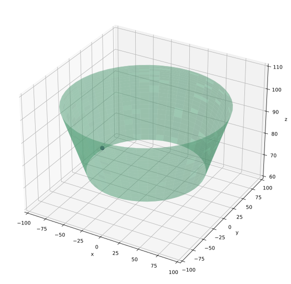
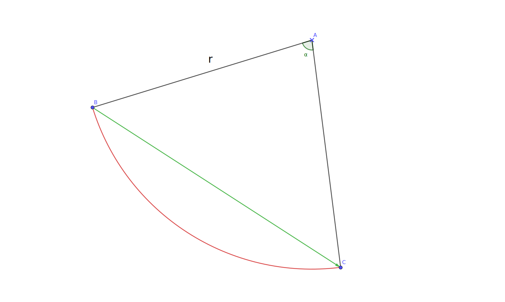
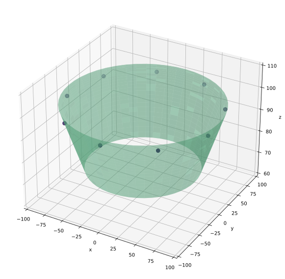
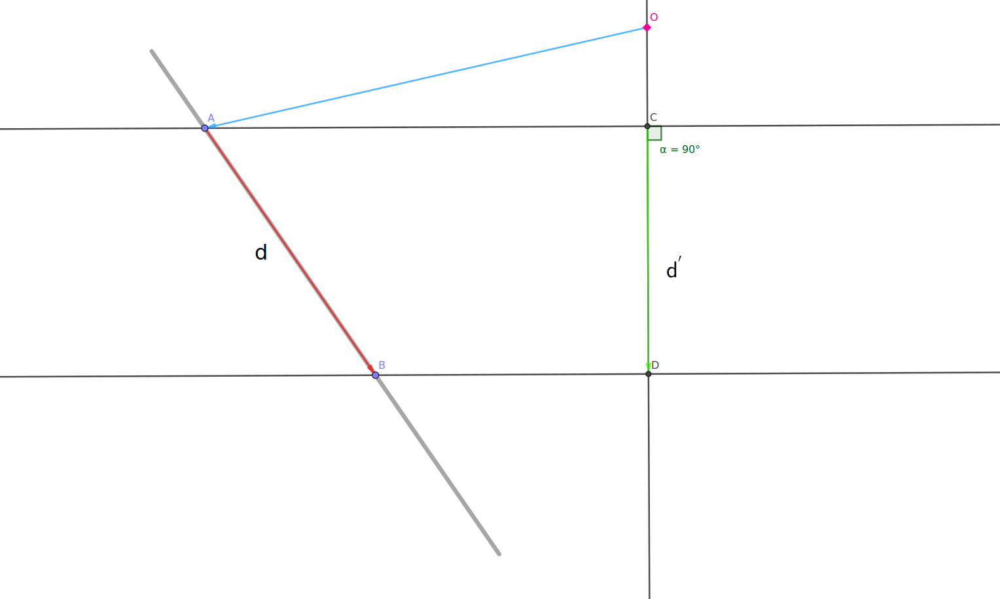
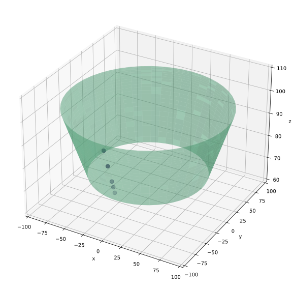
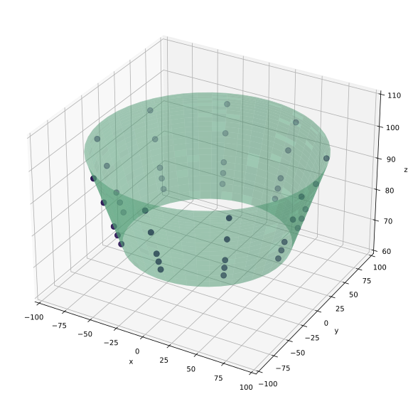

# 回转体测量点规划

实际工件测量过程中, 需要依据模型进行壳体测量点位规划:
- 对于`回转体`的规划可以围绕回转轴实现*围绕回转轴一圈*, *平行回转轴*两个方向的规划
- 对于`其他棱体`的规划可以依据相邻面间的对应*旋转平移变换关系*实现对单面规划的迁移
这里给出了回转体的规划的Python实现, 仅需要简单的矩阵运算即可.

## 1. 桶段和一组检测点绘制

首先使用`matplotlib`的3d绘图功能`Axes3D`

绘制一组检测点,这里只绘制了一个点.


```python
# creating 3d bar plot using matplotlib
# in python

# to interacte with plot    交互式窗口
import numpy as np
import matplotlib.pyplot as plt
from mpl_toolkits.mplot3d import Axes3D

def plot_rotating(markers):

    # # 是否开启交互式窗口
    # %matplotlib widget  
    %config InlineBackend.figure_format = 'svg'   

    # 生成圆锥数据，底面半径为1，高度为1，其余的情形留待发挥
    # 先根据极坐标方式生成数据
    u = np.linspace(0, 2 * np.pi, 50)  # linspace的功能用来创建等差数列
    v = np.linspace(0.25*np.pi, 0.75*np.pi, 50)

    # 数据转化为平面坐标数据
    x = np.outer(np.cos(u), np.sin(v))*100  # outer（a，b） 外积：a的每个元素乘以b的每个元素，二维数组
    y = np.outer(np.sin(u), np.sin(v))*100
    z = np.sqrt(x**2+y**2)  # 圆锥体的高

    markers = np.reshape(markers, (-1, 3))
    
    # 简单方法画出漂亮的圆锥体（底面在上，顶点在原点）
    fig = plt.figure(figsize=(10, 10))
    ax = fig.add_subplot(111, projection='3d')
    # Plot the surface
    ax.plot_surface(x, y, z, color='#76eaae4F')
    ax.scatter(markers[:, 0], markers[:, 1], markers[:, 2], color='#261150', s=60)

    ax.set_xlim(-100, 100)
    ax.set_ylim(-100, 100)
    ax.set_zlim(60, 110)

    ax.set_xlabel('x')
    ax.set_ylabel('y')
    ax.set_zlabel('z')

    plt.show()


# 初始检测点坐标
initPos = np.asarray([0, -97, 97]).reshape((-1, 3))
plot_rotating(initPos)

```


    

    


## 2. 垂直轴方向检测点规划

<!--  -->


垂直轴方向的检测点规划如上图所示, 本质上就是检测点绕回转轴旋转一定的角度.

对于点$p(x,y,z)$绕单位向量为$n_0=(vx,vy,vz)$旋转$\theta$的[旋转矩阵](https://zhuanlan.zhihu.com/p/56587491)为
$$
\mathbf{T} = 
\begin{bmatrix}
  vx^2 \cdot (1-cos\theta )+cos\theta & vx\cdot vy\cdot (1-cos\theta )-vz\cdot sin\theta  & vx\cdot vz\cdot (1-cos\theta )+vy\cdot sin\theta \\
  vx\cdot vy\cdot (1-cos\theta )+vz\cdot sin\theta & vy^2\cdot (1-cos\theta )+cos\theta & vy\cdot vz\cdot (1-cos\theta )-vx\cdot sin\theta \\
  vx\cdot vz\cdot (1-\cos \theta )-vy\cdot \sin \theta & vy\cdot vz\cdot (1-\cos \theta )+vx\cdot \sin \theta & vz^2 \cdot (1-\cos \theta )+\cos \theta
\end{bmatrix}
$$

则旋转后的目标点坐标为:     
$$
p^{'}=(x^{'},y^{'},z^{'})^{T} = \mathbf{T} \cdot (x,y,z)^{T}
$$


```python
n0 = np.asarray([0, 0, -1])  # 回转轴法向量
N = 10                      # 一圈规划N个测量点位

theta = 360/(N-1)  /180 * np.pi

# 返回 旋转矩阵T
def p_around_n0_T(n0, theta):

    x, y, z = n0
    sinT = np.sin(theta)
    cosT = np.cos(theta)
    oneMcosT = 1-cosT

    T = np.asarray([
        [(x**2)*oneMcosT+cosT, x*y*oneMcosT-z*sinT, x*z*oneMcosT+y*sinT],
        [x*y*oneMcosT+z*sinT,(y**2)*oneMcosT+cosT, y*z*oneMcosT-x*sinT],
        [x*z*oneMcosT-y*sinT, y*z*oneMcosT+x*sinT, (z**2)*oneMcosT+cosT]
    ])

    return T
```


```python
np.cos(theta)
```


    0.766044443118978


```python
import copy

temp = copy.deepcopy(initPos)

plan_r = [temp]
T = p_around_n0_T(n0, theta)
for i in range(N-1):
    temp = np.dot(T, temp.T).T
    plan_r.append(temp)

plan_r = np.asanyarray(plan_r).reshape((-1,3))

plot_rotating(plan_r)

```


    

    


## 3. 平行轴方向检测点规划



已知参数:    
1. 回转轴法向量$n_0$     
2. 回转轴上一点$O(x1, y1, z1)$
3. 回转体(圆台、圆锥)锥度$C$ 
4. 平行轴下降高度$d^{'}$

根据空间直线外一点到直线的垂线的 [理论分析1](https://www.cnblogs.com/star91/articles/4770453.html) [理论分析2](https://www.zhihu.com/question/56886236) [代码示例](https://blog.csdn.net/zhouschina/article/details/14647587)

$OC = \overrightarrow{OA} \cdot  \overrightarrow{n_0}$    
$\overrightarrow{OC} = OC \cdot \overrightarrow{n_0}$    
$\overrightarrow{AC} = \overrightarrow{OC}-\overrightarrow{OA}$    
$\overrightarrow{OD} = \overrightarrow{OC} + d^{'} \cdot \overrightarrow{n_0}$

单位向量为 $\overrightarrow{n_{AC}} = \overrightarrow{AC} / AC$

$\overrightarrow{AB} = \overrightarrow{AC} + \overrightarrow{CD} + \overrightarrow{DB}
                    = d^{'} \cdot \overrightarrow{n_0} + \frac{1}{2} C d^{'} \cdot \overrightarrow{n_{AC}}$ 


```python
initPos
n0
O = np.asarray([0, 0, -130]).reshape((-1, 3))
C = 60/30
dApo = [8, 8, 3, 3]

def parallel_plan(A, n0, O, C, dApo):

    OA_ = A - O
    OC_ = np.dot(OA_, n0)*n0
    AC_ = OC_ - OA_
    AB = dApo * n0 + 0.5*C*dApo*AC_/np.linalg.norm(AC_)

    # print(np.linalg.norm(AC_), np.sum(AC_**2))

    return A + AB

```


```python
temp = copy.deepcopy(initPos)
plan_p = [temp]

for da in dApo:
    temp = parallel_plan(temp, n0, O, C, da)
    plan_p.append(temp)

plan_p = np.asanyarray(plan_p).reshape((-1,3))

plot_rotating(plan_p)
```


    

    


## 4. 两个方向的联合测试


```python
# 以水平方向为基底
temp = copy.deepcopy(plan_p)
plan_pr = [temp]

for i in range(N):
    T = p_around_n0_T(n0, theta*(i+1))
    
    plan_pr.append([np.dot(T, t.T).T for t in plan_p])

plan_pr = np.asanyarray(plan_pr).reshape((-1, 3))
plot_rotating(plan_pr)
```


    

    


## 5. 总结 

输入参数包括如下

    需要的参数:
    1. 回转轴方程
    2. 垂直回转轴方向的规划角(规划组数)
    3. 平行回转轴方向的组间距(规划组数)
    4. 其他从几何体获取的信息(无需用户输入)


此外, 针对回转体的检测点规划还需要注意一些点

    注意点:
    1. 垂直回转轴方向的规划应以回转轴为中心进行
    
