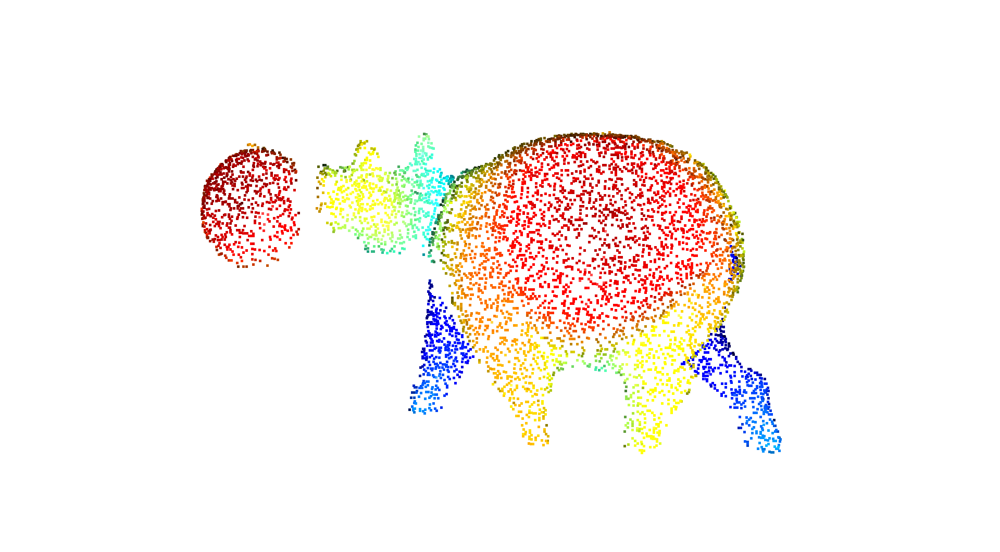
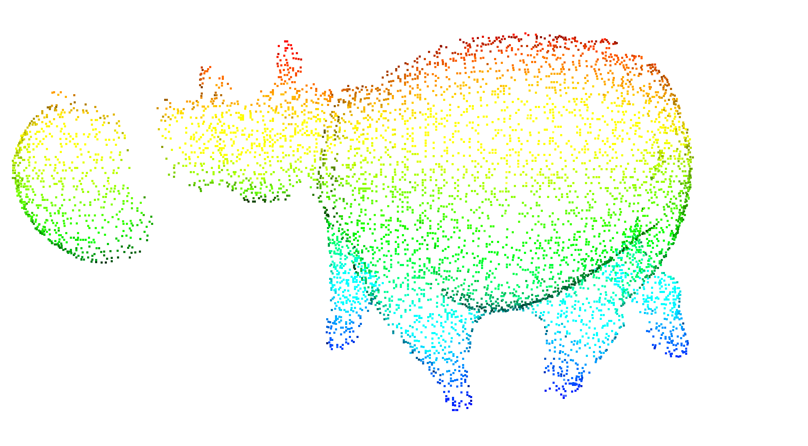

# 点云高度映射到色彩

一个简单的效果展示功能, 将点云高度(某种特征值)映射到色谱图.


```python
import open3d as o3d
import numpy as np
import open3d_tutorial

pt = o3d.io.read_point_cloud("hippo1.ply")
o3d.visualization.draw_geometries([pt])
```

    Jupyter environment detected. Enabling Open3D WebVisualizer.
    [Open3D INFO] WebRTC GUI backend enabled.
    [Open3D INFO] WebRTCWindowSystem: HTTP handshake server disabled.
    


    

    


```python
# o3d.utility.Vector3dVector(temp)
ptIndex = np.asanyarray(pt.points)
print(ptIndex.shape)
```

    (6104, 3)
    


```python
import matplotlib.pyplot as plt
import matplotlib as mpl
import matplotlib
import copy

%matplotlib inline 
%config InlineBackend.figure_format = 'svg'
plt.rcParams['font.sans-serif'] = ['Simsun']  #显示中文
plt.rcParams['axes.unicode_minus'] = False    #显示负号
```


```python
z = ptIndex[:, 1]

vmin=np.min(z)
vmax=np.max(z)
# 归一化色彩
norm = mpl.colors.Normalize(vmin, vmax)
```


```python
hsvColor = matplotlib.cm.get_cmap('hsv')
hsvColortemp = hsvColor(np.linspace(2/3, 0, 256))   # 数值映射
GomColorBar = mpl.colors.ListedColormap(hsvColortemp)

# cmap1 = copy.copy(mpl.cm.viridis)
# im1 = mpl.cm.ScalarMappable(norm=norm, cmap=cmap1)

pt.colors = o3d.utility.Vector3dVector(GomColorBar(norm(z))[:, :3])
o3d.visualization.draw_geometries([pt])
```


    

    


```python
def PlotColorbar(cmap, Range=[0, 10], label='Some Units'):
    fig, ax = plt.subplots(figsize=(0.5, 10))
    fig.subplots_adjust(bottom=0.5)
    norm = mpl.colors.Normalize(vmin=Range[0], vmax=Range[1])    # 归一化显示
    Colorbar = mpl.cm.ScalarMappable(norm=norm, cmap=cmap)
    fig.colorbar(Colorbar, cax=ax, orientation='vertical', label=label)

PlotColorbar(GomColorBar, [vmin, vmax], "高度")
```


    

    


```python
o3d.io.write_point_cloud("out.ply", pt)
```


    True


