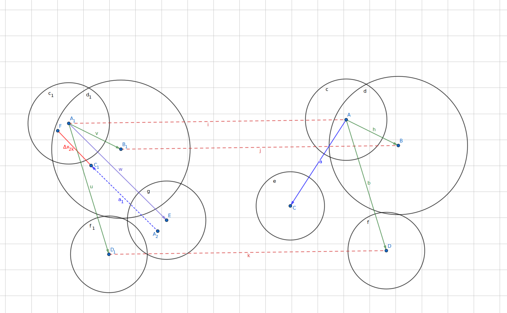
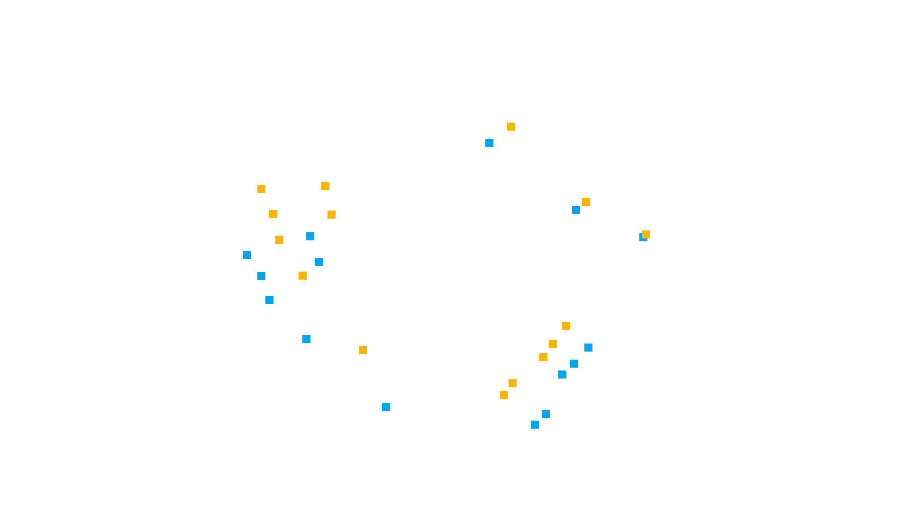
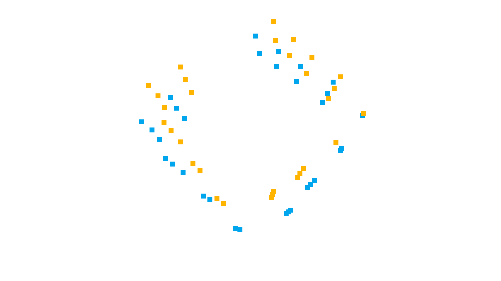
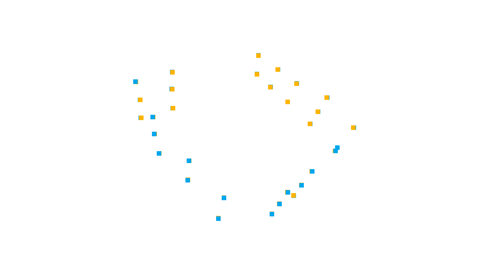

# 球心配准求解旋转矩阵

## 1. 问题描述
两组球心数据，现在想做一个算法，从两组球心得到旋转平移矩阵。
实际应用时，**两组数据可能不会按一定的顺序**，**两组数据的点数也有可能不一样**
可能商业软件中类似的算法比较成熟, 但我们自己写程序的时候还难以找到现成的例子.


## 2. 解决思路
首先要围绕n(n>=3)个点可以求解一组旋转平移矩阵来解决问题. 在此前提下, 最重要的是找到至少3组相对应的球心, 剩下的就是一些操作运算技巧.

1. 如果不考虑球心簇的整体特征, 我们唯一能计算的就只有球心间的距离, 或者向量. 因此可以利用距离进行最大相同元素匹配, 注意, 该方法可能在球排布非常对称且规律时失效, 那时候它们间的距离基本相等, 大部分算法也都将失效.
2. 首先计算点数较少的球心簇$X_1$之间任意两球心间的距离并存储为二维数组$AX1$, 同理可得到$AX2$.
3. 两种思路:
    - 距离差异排序的思想: 对$X_2$中的每个点$x_2k$, 计算其与$X_1$中的每个点$x_1g$, 两者与自身点簇中的其他球心距离的最小差异的和, 记作 $\Delta x_{2k}$. 根据球心个数确定点对的数量期望$e$, 取前$e$个最小的$\Delta x_{2k}$所对应的点对.
    - 距离匹配的思想(距离阈值选取困难, 弃用): 对点数较多的球心簇$X_2$中的第1个球心$x_{21}$, 计算其到其他所有球心的距离, 得到一个一维数组$b$, 用$b$去匹配$A$中的行或者列元素$a_i$, 对于每个值小于阈值$t$的就可以认为该值相同, 最终得到与$b$中距离相同最多的行, 该行所对应的球心$x_{1i}$就被认为是与$x_{21}$相对应的点.重复步骤, 直到得到至少3对点满足旋转平移矩阵求解条件.
4. 将所得点对求解旋转平移矩阵. 如果$X_2$中球心数量远多于$X_1$, 也可只计算3对点, 后续利用旋转平移矩阵变换结果优化计算.


## 3. 程序求解
### 1. 读取点簇

txt文件内球心的格式如下:

    -2961.173999,  2203.133723,  1162.113420
    -3000.240942,  2168.539521,  218.369990
    ...
    -2989.678087,  2176.238251,  -1021.582163


```python
def readFile(fileName):
    with open(fileName, "r") as fX:
        X = fX.readlines()
    fX.close()
    return [list(eval(x)) for x in X]


path = r"./数据对齐测试/"
fileX1 = "球组1.txt"
fileX2 = "球组2.txt"

X1 = readFile(path+fileX1)
X2 = readFile(path+fileX2)

print(X1)
```

    [[-2961.173999, 2203.133723, 1162.11342], [-3000.240942, 2168.539521, 218.36999], [-2989.678087, 2176.238251, -1021.582163], [-4236.739386, 1125.249897, 1238.200894], [-4198.579595, 1159.895533, 246.154171], [-4274.45294, 1098.254518, -817.695381], [-3223.301715, -690.80322, 1198.205349], [-3270.147061, -638.337994, 176.068267], [-3130.036653, -803.216326, -887.575805], [-1769.760322, -2413.017377, 1102.840823], [-1782.880403, -2398.382094, -184.73588], [-629.529873, -3774.796008, 1311.298811], [-614.873328, -3789.880423, -235.863746], [1472.613475, -3395.709771, 1141.216294], [1476.145934, -3392.934957, 251.281519], [1459.903266, -3403.205121, -633.023667], [2649.380134, -2399.83637, 965.271792], [2685.702515, -2366.029872, -134.327908], [2744.342989, -2307.228065, -1165.400423], [4059.032636, -1208.092668, 810.740727], [5261.173761, 74.128209, 1020.833226], [4396.90773, 1824.37522, 1165.251081], [4384.980844, 1836.195282, 182.035095], [4365.307438, 1865.26009, -780.639522], [3247.013382, 3189.373594, 782.469559], [3219.378796, 3225.108755, -555.724815], [2358.587396, 4245.408259, 789.096429], [2312.136833, 4300.12545, -480.34152], [1362.436383, 5424.783661, 776.908753], [1534.981196, 5224.099423, -354.097706]]
    


```python
# 打乱X1的顺序
import random
random.shuffle(X1)
print(X1)
```

    [[-629.529873, -3774.796008, 1311.298811], [1362.436383, 5424.783661, 776.908753], [4384.980844, 1836.195282, 182.035095], [-2961.173999, 2203.133723, 1162.11342], [-1782.880403, -2398.382094, -184.73588], [-4236.739386, 1125.249897, 1238.200894], [2744.342989, -2307.228065, -1165.400423], [3219.378796, 3225.108755, -555.724815], [1534.981196, 5224.099423, -354.097706], [-3000.240942, 2168.539521, 218.36999], [-3223.301715, -690.80322, 1198.205349], [5261.173761, 74.128209, 1020.833226], [4365.307438, 1865.26009, -780.639522], [-4198.579595, 1159.895533, 246.154171], [3247.013382, 3189.373594, 782.469559], [2358.587396, 4245.408259, 789.096429], [-2989.678087, 2176.238251, -1021.582163], [2649.380134, -2399.83637, 965.271792], [2312.136833, 4300.12545, -480.34152], [-3130.036653, -803.216326, -887.575805], [-3270.147061, -638.337994, 176.068267], [2685.702515, -2366.029872, -134.327908], [-4274.45294, 1098.254518, -817.695381], [4396.90773, 1824.37522, 1165.251081], [1476.145934, -3392.934957, 251.281519], [4059.032636, -1208.092668, 810.740727], [1472.613475, -3395.709771, 1141.216294], [-1769.760322, -2413.017377, 1102.840823], [1459.903266, -3403.205121, -633.023667], [-614.873328, -3789.880423, -235.863746]]
    

### 2. 计算球心间距离


```python
# # 球心数量较少的点簇记为 $X_1$, 数量较多的点簇记为 $X_2$
# # 判断点簇数量
# if len(X1) > len(X2):
#     X1, X2 = X2, X1

# 距离矩阵
import numpy as np
AX1 = np.zeros((len(X1), len(X1)), dtype=np.float64)
AX2 = np.zeros((len(X2), len(X2)), dtype=np.float64)

distances = lambda a, b: ((a[0] - b[0])**2+(a[1] - b[1])**2+(a[2] - b[2])**2)**0.5

# 计算相互球心距离
for i in range(len(X1)-1):
    for j in range(i+1, len(X1)):
        AX1[i][j] = AX1[j][i] = distances(X1[i], X1[j])

AX1
```


    array([[   0.        , 9427.92492468, 7609.45316877, 6418.2913988 ,
            2337.274589  , 6085.0434384 , 4435.17901014, 8203.56884858,
            9404.18910405, 6491.37902073, 4031.3092186 , 7042.65412951,
            7818.87706394, 6182.54232715, 7987.92252285, 8574.68463709,
            6813.76855952, 3572.32410876, 8778.82307817, 4462.94404404,
            4254.28917625, 3881.39464923, 6447.06924601, 7525.76397163,
            2388.1635467 , 5368.53265165, 2142.81149269, 1788.30121888,
            2878.22871366, 1547.3055069 ],
           [9427.92492468,    0.        , 4729.44143019, 5405.64683399,
            8486.4421588 , 7074.57068092, 8091.12082062, 3172.17859583,
            1161.55993654, 5472.48068897, 7655.51354413, 6624.88989019,
            4910.53960929, 7028.21953828, 2923.81934383, 1543.82373313,
            5720.88430365, 7931.98483875, 1935.83710194, 7857.53184283,
            7653.97170485, 7954.75713108, 7282.591435  , 4724.5917349 ,
            8834.10298091, 7160.15533002, 8828.70111398, 8446.77530329,
            8940.40240467, 9478.68640735],
           [7609.45316877, 4729.44143019,    0.        , 7420.32265605,
            7490.57266594, 8715.21596174, 4655.66666321, 1957.54909379,
            4459.57742869, 7392.78524957, 8081.10678755, 2139.20001452,
             963.31418768, 8610.40082786, 1867.23941534, 3206.10371602,
            7479.96778557, 4644.32273909, 3287.30542342, 8036.54459915,
            8045.14349027, 4543.8231297 , 8748.13186088,  983.35936442,
            5984.13892363, 3125.57228816, 6064.21823058, 7535.55109004,
            6055.71764581, 7538.29616166],
           [6418.2913988 , 5405.64683399, 7420.32265605,    0.        ,
            4937.23876771, 1671.73260498, 7636.33473915, 6495.73968224,
            5624.9925757 ,  945.18498005, 2906.00836146, 8494.68229295,
            7587.21146616, 1859.70424421, 6297.49069884, 5710.50683002,
            2184.04721759, 7259.77947206, 5907.8625292 , 3642.51027893,
            3023.52623857, 7378.70113497, 2620.13406585, 7367.82427716,
            7199.68107703, 7813.01666824, 7141.84545652, 4767.79097366,
            7362.02937905, 6586.02198216],
           [2337.274589  , 8486.4421588 , 7490.57266594, 4937.23876771,
               0.        , 4523.51139926, 4633.11597567, 7535.50789348,
            8314.99329496, 4743.54657001, 2627.38760176, 7562.1030893 ,
            7505.59521637, 4322.33831312, 7580.12740516, 7889.23666465,
            4804.56279513, 4579.02317404, 7856.62473169, 2203.03603   ,
            2332.35867277, 4468.98432812, 4339.93537203, 7605.51941005,
            3435.18547313, 6044.47769025, 3653.90914676, 1287.72671563,
            3424.36522285, 1817.44936258],
           [6085.0434384 , 7074.57068092, 8715.21596174, 1671.73260498,
            4523.51139926,    0.        , 8142.1566785 , 7951.18073099,
            7255.94519997, 1912.44260419, 2080.07319111, 9558.37118206,
            8866.70972082,  993.38471418, 7776.55792615, 7309.95337781,
            2786.81859266, 7740.76000973, 7478.03467079, 3076.15010793,
            2274.35016859, 7873.56790854, 2056.4193532 , 8662.21452148,
            7350.17434536, 8628.26999815, 7283.21305632, 4315.51194568,
            7513.9951898 , 6280.86668921],
           [4435.17901014, 8091.12082062, 4655.66666321, 7636.33473915,
            4633.11597567, 8142.1566785 ,    0.        , 5586.06427235,
            7670.83188295, 7412.66217901, 6619.08187275, 4096.93939504,
            4492.79691278, 7887.81379237, 5853.16194791, 6848.78880654,
            7280.18898097, 2134.79702308, 6656.81818394, 6070.22026023,
            6384.26369105, 1034.41137314, 7809.07848035, 5023.25117438,
            2189.53669767, 2615.65313709, 2850.0121158 , 5053.0424925 ,
            1770.41693384, 3787.69464358],
           [8203.56884858, 3172.17859583, 1957.54909379, 6495.73968224,
            7535.50789348, 7951.18073099, 5586.06427235,    0.        ,
            2621.79565503, 6356.03893936, 7740.72152858, 4072.24021111,
            1792.46407765, 7741.71959264, 1338.95662913, 1894.8659822 ,
            6314.23311093, 5854.77043209, 1408.69851818, 7526.79244976,
            7587.86450498, 5632.33671512, 7794.20628482, 2512.04833972,
            6891.19892386, 4714.39513675, 7054.50467207, 7709.13843401,
            6858.2996502 , 8000.86705435],
           [9404.18910405, 1161.55993654, 4459.57742869, 5624.9925757 ,
            8314.99329496, 7255.94519997, 7670.83188295, 2621.79565503,
               0.        , 5498.40025996, 7748.3530064 , 6503.62588133,
            4412.99062109, 7053.49380941, 2891.87630319, 1715.53385203,
            5496.13817615, 7817.09778889, 1213.93421876, 7640.38778805,
            7598.58578904, 7680.00787974, 7140.52126703, 4696.50602885,
            8638.4736557 , 7007.19482691, 8748.76929815, 8448.04944321,
            8632.13878956, 9267.56097405],
           [6491.37902073, 5472.48068897, 7392.78524957,  945.18498005,
            4743.54657001, 1912.44260419, 7412.66217901, 6356.03893936,
            5498.40025996,    0.        , 3030.78774409, 8560.46020281,
            7439.17343234, 1566.57275047, 6355.19449876, 5775.47864503,
            1240.0210426 , 7303.84411702, 5766.55997725, 3173.53050123,
            2820.14186399, 7281.25458856, 1960.2442849 , 7465.4431444 ,
            7139.26613888, 7847.66790065, 7198.53749869, 4825.66418436,
            7187.63492889, 6434.21130908],
           [4031.3092186 , 7655.51354413, 8081.10678755, 2906.00836146,
            2627.38760176, 2080.07319111, 6619.08187275, 7740.72152858,
            7748.3530064 , 3030.78774409,    0.        , 8520.73383365,
            8248.41048598, 2298.40254592, 7556.02976499, 7462.64295818,
            3633.45061813, 6120.738881  , 7639.89322564, 2090.88930854,
            1024.55419612, 6284.77208869, 2893.00920167, 8024.63709799,
            5502.99817096, 7310.95826866, 5419.53749629, 2255.63706667,
            5713.39939753, 4297.06089432],
           [7042.65412951, 6624.88989019, 2139.20001452, 8494.68229295,
            7562.1030893 , 9558.37118206, 4096.93939504, 4072.24021111,
            6503.62588133, 8560.46020281, 8520.73383365,    0.        ,
            2693.7026461 , 9553.32151016, 3717.31261516, 5087.07055238,
            8755.9627379 , 3597.92353464, 5367.43859785, 8650.09657025,
            8602.59675297, 3731.19563207, 9765.10106022, 1957.339237  ,
            5190.29599136, 1770.13347518, 5138.8186124 , 7458.32772754,
            5410.79911719, 7144.07302453],
           [7818.87706394, 4910.53960929,  963.31418768, 7587.21146616,
            7505.59521637, 8866.70972082, 4492.79691278, 1792.46407765,
            4412.99062109, 7439.17343234, 8248.41048598, 2693.7026461 ,
               0.        , 8654.01672983, 2333.91691503, 3486.56013704,
            7365.49881853, 4917.68854667, 3199.10264677, 7956.90799204,
            8092.18503039, 4598.1089746 , 8673.81865578, 1946.57658208,
            6087.75249032, 3474.44852118, 6303.88864269, 7712.98986868,
            6018.2962309 , 7555.10392582],
           [6182.54232715, 7028.21953828, 8610.40082786, 1859.70424421,
            4322.33831312,  993.38471418, 7887.81379237, 7741.71959264,
            7053.49380941, 1566.57275047, 2298.40254592, 9553.32151016,
            8654.01672983,    0.        , 7735.84321032, 7267.15996973,
            2025.22857698, 7751.34658134, 7264.86533437, 2506.17953234,
            2024.97970897, 7744.04653551, 1068.33152556, 8669.98700914,
            7275.35577067, 8608.96543476, 7329.1955034 , 4404.40481144,
            7322.10827137, 6129.89183388],
           [7987.92252285, 2923.81934383, 1867.23941534, 6297.49069884,
            7580.12740516, 7776.55792615, 5853.16194791, 1338.95662913,
            2891.87630319, 6355.19449876, 7556.02976499, 3717.31261516,
            2333.91691503, 7735.84321032,    0.        , 1380.05574586,
            6570.94866198, 5624.04215642, 1924.17662098, 7706.91851105,
            7582.37949246, 5658.4534243 , 7969.05028584, 1825.37647245,
            6837.02553109, 4471.8993787 , 6829.38629555, 7527.11370552,
            6975.63457709, 8041.21622112],
           [8574.68463709, 1543.82373313, 3206.10371602, 5710.50683002,
            7889.23666465, 7309.95337781, 6848.78880654, 1894.8659822 ,
            1715.53385203, 5775.47864503, 7462.64295818, 5087.07055238,
            3486.56013704, 7267.15996973, 1380.05574586,    0.        ,
            6013.64824064, 6653.93675611, 1271.46542704, 7643.61393137,
            7477.26103453, 6683.62408932, 7515.55591352, 3187.10575321,
            7707.93324418, 5712.49987752, 7700.36511708, 7840.68379516,
            7831.43316192, 8628.89774192],
           [6813.76855952, 5720.88430365, 7479.96778557, 2184.04721759,
            4804.56279513, 2786.81859266, 7280.18898097, 6314.23311093,
            5496.13817615, 1240.0210426 , 3633.45061813, 8755.9627379 ,
            7365.49881853, 2025.22857698, 6570.94866198, 6013.64824064,
               0.        , 7529.07864186, 5736.99221837, 2985.76754076,
            3071.62315996, 7323.20727494, 1689.45706409, 7711.53015047,
            7251.16930986, 8030.90441974, 7458.97767189, 5202.17642876,
            7147.02317494, 6469.28304424],
           [3572.32410876, 7931.98483875, 4644.32273909, 7259.77947206,
            4579.02317404, 7740.76000973, 2134.79702308, 5854.77043209,
            7817.09778889, 7303.84411702, 6120.738881  , 3597.92353464,
            4917.68854667, 7751.34658134, 5624.04215642, 6653.93675611,
            7529.07864186,    0.        , 6862.43537539, 6275.65918294,
            6226.27665181, 1100.71871743, 7959.59020536, 4575.78495691,
            1694.84671917, 1852.36418603, 1551.61208694, 4421.30086593,
            2230.72912839, 3745.70416799],
           [8778.82307817, 1935.83710194, 3287.30542342, 5907.8625292 ,
            7856.62473169, 7478.03467079, 6656.81818394, 1408.69851818,
            1213.93421876, 5766.55997725, 7639.89322564, 5367.43859785,
            3199.10264677, 7264.86533437, 1924.17662098, 1271.46542704,
            5736.99221837, 6862.43537539,    0.        , 7471.75945124,
            7482.05776972, 6685.57428464, 7331.36753481, 3630.92053105,
            7772.85864275, 5921.06452849, 7909.49612564, 8014.65141668,
            7751.83305914, 8606.7039504 ],
           [4462.94404404, 7857.53184283, 8036.54459915, 3642.51027893,
            2203.03603   , 3076.15010793, 6070.22026023, 7526.79244976,
            7640.38778805, 3173.53050123, 2090.88930854, 8650.09657025,
            7956.90799204, 2506.17953234, 7706.91851105, 7643.61393137,
            2985.76754076, 6275.65918294, 7471.75945124,    0.        ,
            1085.42825774, 6068.98596506, 2220.39710011, 8232.44965373,
            5405.60418612, 7398.03495107, 5658.7461371 , 2898.89107652,
            5281.31489168, 3958.65350689],
           [4254.28917625, 7653.97170485, 8045.14349027, 3023.52623857,
            2332.35867277, 2274.35016859, 6384.26369105, 7587.86450498,
            7598.58578904, 2820.14186399, 1024.55419612, 8602.59675297,
            8092.18503039, 2024.97970897, 7582.37949246, 7477.26103453,
            3071.62315996, 6226.27665181, 7482.05776972, 1085.42825774,
               0.        , 6209.139166  , 2238.73849286, 8113.3943687 ,
            5488.23821059, 7378.6383941 , 5570.31303721, 2501.91020014,
            5538.27555143, 4141.54394668],
           [3881.39464923, 7954.75713108, 4543.8231297 , 7378.70113497,
            4468.98432812, 7873.56790854, 1034.41137314, 5632.33671512,
            7680.00787974, 7281.25458856, 6284.77208869, 3731.19563207,
            4598.1089746 , 7744.04653551, 5658.4534243 , 6683.62408932,
            7323.20727494, 1100.71871743, 6685.57428464, 6068.98596506,
            6209.139166  ,    0.        , 7804.61539063, 4709.20626768,
            1632.86735727, 2029.78050895, 2039.32310452, 4624.27760699,
            1681.37258097, 3596.03403952],
           [6447.06924601, 7282.591435  , 8748.13186088, 2620.13406585,
            4339.93537203, 2056.4193532 , 7809.07848035, 7794.20628482,
            7140.52126703, 1960.2442849 , 2893.00920167, 9765.10106022,
            8673.81865578, 1068.33152556, 7969.05028584, 7515.55591352,
            1689.45706409, 7959.59020536, 7331.36753481, 2220.39710011,
            2238.73849286, 7804.61539063,    0.        , 8924.78704588,
            7374.47502692, 8798.75123785, 7553.92761149, 4721.33188223,
            7292.46759477, 6133.91507844],
           [7525.76397163, 4724.5917349 ,  983.35936442, 7367.82427716,
            7605.51941005, 8662.21452148, 5023.25117438, 2512.04833972,
            4696.50602885, 7465.4431444 , 8024.63709799, 1957.339237  ,
            1946.57658208, 8669.98700914, 1825.37647245, 3187.10575321,
            7711.53015047, 4575.78495691, 3630.92053105, 8232.44965373,
            8113.3943687 , 4709.20626768, 8924.78704588,    0.        ,
            6048.67880717, 3071.75823625, 5983.42392565, 7482.45854816,
            6259.98270864, 7655.12498636],
           [2388.1635467 , 8834.10298091, 5984.13892363, 7199.68107703,
            3435.18547313, 7350.17434536, 2189.53669767, 6891.19892386,
            8638.4736557 , 7139.26613888, 5502.99817096, 5190.29599136,
            6087.75249032, 7275.35577067, 6837.02553109, 7707.93324418,
            7251.16930986, 1694.84671917, 7772.85864275, 5405.60418612,
            5488.23821059, 1632.86735727, 7374.47502692, 6048.67880717,
               0.        , 3428.96983781,  889.94611163, 3495.89747198,
             884.51396966, 2183.40050523],
           [5368.53265165, 7160.15533002, 3125.57228816, 7813.01666824,
            6044.47769025, 8628.26999815, 2615.65313709, 4714.39513675,
            7007.19482691, 7847.66790065, 7310.95826866, 1770.13347518,
            3474.44852118, 8608.96543476, 4471.8993787 , 5712.49987752,
            8030.90441974, 1852.36418603, 5921.06452849, 7398.03495107,
            7378.6383941 , 2029.78050895, 8798.75123785, 3071.75823625,
            3428.96983781,    0.        , 3403.59321396, 5959.19401997,
            3695.73372806, 5441.17688511],
           [2142.81149269, 8828.70111398, 6064.21823058, 7141.84545652,
            3653.90914676, 7283.21305632, 2850.0121158 , 7054.50467207,
            8748.76929815, 7198.53749869, 5419.53749629, 5138.8186124 ,
            6303.88864269, 7329.1955034 , 6829.38629555, 7700.36511708,
            7458.97767189, 1551.61208694, 7909.49612564, 5658.7461371 ,
            5570.31303721, 2039.32310452, 7553.92761149, 5983.42392565,
             889.94611163, 3403.59321396,    0.        , 3388.23624582,
            1774.30131852, 2531.66370045],
           [1788.30121888, 8446.77530329, 7535.55109004, 4767.79097366,
            1287.72671563, 4315.51194568, 5053.0424925 , 7709.13843401,
            8448.04944321, 4825.66418436, 2255.63706667, 7458.32772754,
            7712.98986868, 4404.40481144, 7527.11370552, 7840.68379516,
            5202.17642876, 4421.30086593, 8014.65141668, 2898.89107652,
            2501.91020014, 4624.27760699, 4721.33188223, 7482.45854816,
            3495.89747198, 5959.19401997, 3388.23624582,    0.        ,
            3797.94999805, 2240.90288487],
           [2878.22871366, 8940.40240467, 6055.71764581, 7362.02937905,
            3424.36522285, 7513.9951898 , 1770.41693384, 6858.2996502 ,
            8632.13878956, 7187.63492889, 5713.39939753, 5410.79911719,
            6018.2962309 , 7322.10827137, 6975.63457709, 7831.43316192,
            7147.02317494, 2230.72912839, 7751.83305914, 5281.31489168,
            5538.27555143, 1681.37258097, 7292.46759477, 6259.98270864,
             884.51396966, 3695.73372806, 1774.30131852, 3797.94999805,
               0.        , 2147.54550756],
           [1547.3055069 , 9478.68640735, 7538.29616166, 6586.02198216,
            1817.44936258, 6280.86668921, 3787.69464358, 8000.86705435,
            9267.56097405, 6434.21130908, 4297.06089432, 7144.07302453,
            7555.10392582, 6129.89183388, 8041.21622112, 8628.89774192,
            6469.28304424, 3745.70416799, 8606.7039504 , 3958.65350689,
            4141.54394668, 3596.03403952, 6133.91507844, 7655.12498636,
            2183.40050523, 5441.17688511, 2531.66370045, 2240.90288487,
            2147.54550756,    0.        ]])


```python
# X2相邻球心间距离
for i in range(len(X2)-1):
    for j in range(i+1, len(X2)):
        AX2[i][j] = AX2[j][i] = distances(X2[i], X2[j])

AX2
```


    array([[   0.        ,  950.3454932 , 2196.22690582, 1676.93486344,
            1866.781117  , 2630.8311604 , 2920.90180929, 3039.14016221,
            3661.60885187, 4792.28510403, 4963.00424345, 6446.96044865,
            6616.01147565, 7175.40811175, 7233.86688935, 7396.69361052,
            7295.5396984 , 7415.29807969, 7673.63089924, 7734.64214812,
            7850.35099845, 8531.64988005, 7403.20295946, 7456.41443587,
            7623.79831824, 6330.12449697, 6529.33236996, 5739.52571189,
            5937.66356659, 5429.98130334, 5651.27947239],
           [ 950.3454932 ,    0.        , 1247.07129475, 1918.73695894,
            1571.36391957, 1966.61601508, 3046.41034153, 2834.87850412,
            3190.16722542, 4850.61567809, 4768.46744098, 6520.51326792,
            6463.61902344, 7232.57144369, 7173.42446469, 7221.72802968,
            7340.1899665 , 7317.74076552, 7449.18034281, 7822.01422384,
            7885.53352756, 8598.12137901, 7501.7200018 , 7429.17066979,
            7475.44317791, 6388.56911089, 6389.35720146, 5805.18787658,
            5796.06793587, 5497.3959605 , 5524.25167774],
           [2196.22690582, 1247.07129475,    0.        , 2799.15419292,
            2033.95951851, 1695.07937569, 3652.32164427, 3087.85183505,
            3001.11535618, 5228.65841237, 4829.26001061, 6843.9580583 ,
            6498.29641228, 7493.46463997, 7285.08551358, 7180.1151233 ,
            7565.72269468, 7359.01653241, 7315.08093454, 8075.45681931,
            8068.75214089, 8793.72371114, 7748.25883376, 7515.97010131,
            7400.5448487 , 6604.74275036, 6346.58461739, 6044.01351547,
            5765.83133689, 5746.82312269, 5521.53578286],
           [1676.93486344, 1918.73695894, 2799.15419292,    0.        ,
             997.52790142, 2065.19418117, 2088.80393138, 2283.67325749,
            3090.13300201, 4334.98633098, 4544.20705178, 6109.73554955,
            6306.8024367 , 7313.90692444, 7381.35498586, 7545.66837378,
            7774.5012836 , 7908.14129267, 8177.55156891, 8500.35212598,
            8664.94886374, 9595.81051761, 8699.19283603, 8752.84502589,
            8904.75270322, 7812.00439127, 7987.41938896, 7342.80673346,
            7511.47564516, 7103.83664511, 7286.68418224],
           [1866.781117  , 1571.36391957, 2033.95951851,  997.52790142,
               0.        , 1072.93131248, 2308.7365477 , 2033.81875588,
            2517.87624744, 4424.67894534, 4342.5209818 , 6207.85666637,
            6155.50214723, 7360.38481802, 7306.61389815, 7353.38702279,
            7785.62162466, 7778.55797676, 7922.57224902, 8534.3425222 ,
            8646.02066819, 9591.1895138 , 8707.50262679, 8648.10188855,
            8691.6625727 , 7771.65353795, 7777.56105467, 7300.2929661 ,
            7297.88921349, 7057.6477031 , 7083.70603027],
           [2630.8311604 , 1966.61601508, 1695.07937569, 2065.19418117,
            1072.93131248,    0.        , 2905.75240593, 2248.25307886,
            2229.96820261, 4742.52845136, 4359.59106887, 6473.01843669,
            6159.09478486, 7585.42600174, 7405.56459739, 7323.05292333,
            7994.15145241, 7838.75191639, 7842.82654103, 8777.27524133,
            8835.94785859, 9803.22904178, 8962.79068423, 8785.80810699,
            8710.92134101, 8005.31758154, 7829.66701015, 7549.2378929 ,
            7364.17764215, 7312.69539323, 7170.59729296],
           [2920.90180929, 3046.41034153, 3652.32164427, 2088.80393138,
            2308.7365477 , 2905.75240593,    0.        , 1029.2549694 ,
            2101.7061705 , 2266.76725943, 2640.72781609, 4047.870532  ,
            4315.47677626, 5443.73865183, 5527.84347077, 5739.04001702,
            6149.28744454, 6314.4295548 , 6650.0349697 , 7134.72239392,
            7344.20040309, 8556.19338965, 8061.24424659, 8118.51082796,
            8286.38372903, 7593.06286033, 7778.69277226, 7498.68313591,
            7676.6002027 , 7689.3601613 , 7783.46727455],
           [3039.14016221, 2834.87850412, 3087.85183505, 2283.67325749,
            2033.81875588, 2248.25307886, 1029.2549694 ,    0.        ,
            1091.68009292, 2514.05434232, 2344.28593755, 4271.62672069,
            4159.17121608, 5595.12221879, 5513.08922268, 5563.26063054,
            6255.51325473, 6238.70198217, 6414.38706141, 7267.34022915,
            7412.41055936, 8638.67951932, 8150.75298445, 8082.77142948,
            8129.85131727, 7619.95523948, 7625.56420058, 7513.73932639,
            7518.49132449, 7688.13015384, 7633.33480045],
           [3661.60885187, 3190.16722542, 3001.11535618, 3090.13300201,
            2517.87624744, 2229.96820261, 2101.7061705 , 1091.68009292,
               0.        , 2913.08750367, 2213.92709798, 4481.2460577 ,
            3975.12593041, 5683.657317  , 5429.71489724, 5304.64787181,
            6304.85578621, 6097.45623572, 6098.27305251, 7351.14974451,
            7431.53511968, 8686.10206282, 8270.11230802, 8073.78175685,
            7993.49386899, 7744.85853394, 7563.80592304, 7680.69082708,
            7507.86394835, 7892.54248831, 7675.0435549 ],
           [4792.28510403, 4850.61567809, 5228.65841237, 4334.98633098,
            4424.67894534, 4742.52845136, 2266.76725943, 2514.05434232,
            2913.08750367,    0.        , 1294.06606189, 1793.7086877 ,
            2249.37060548, 3402.84570186, 3511.204194  , 3814.48878453,
            4441.49871101, 4645.73235903, 5076.37927134, 5733.04306584,
            5985.88951226, 7488.85387854, 7516.12064606, 7569.97587915,
            7748.05759449, 7563.50650297, 7746.42309125, 7878.10452384,
            8052.64852488, 8483.9178883 , 8485.98091702],
           [4963.00424345, 4768.46744098, 4829.26001061, 4544.20705178,
            4342.5209818 , 4359.59106887, 2640.72781609, 2344.28593755,
            2213.92709798, 1294.06606189,    0.        , 2345.18214874,
            1823.2365207 , 3669.41412463, 3450.02206755, 3438.99351473,
            4600.02432995, 4489.75080106, 4654.44455419, 5919.5034513 ,
            6071.60738033, 7593.20412365, 7640.01207549, 7525.04874811,
            7539.93752781, 7617.14440929, 7572.29745781, 7927.24505492,
            7894.27692458, 8524.12609844, 8352.60092876],
           [6446.96044865, 6520.51326792, 6843.9580583 , 6109.73554955,
            6207.85666637, 6473.01843669, 4047.870532  , 4271.62672069,
            4481.2460577 , 1793.7086877 , 2345.18214874,    0.        ,
            1553.10640198, 2151.6255381 , 2397.69939909, 2889.68525083,
            3586.66781064, 3897.18641341, 4453.56076503, 5088.79688203,
            5390.37345538, 7069.26102372, 7556.24152685, 7640.66664101,
            7850.84909873, 8022.27769095, 8238.85523204, 8611.23185553,
            8815.94419227, 9465.3192312 , 9442.14313684],
           [6616.01147565, 6463.61902344, 6498.29641228, 6306.8024367 ,
            6155.50214723, 6159.09478486, 4315.47677626, 4159.17121608,
            3975.12593041, 2249.37060548, 1823.2365207 , 1553.10640198,
               0.        , 2541.59407132, 2192.09633065, 2156.2020137 ,
            3760.91401887, 3610.79026618, 3803.51685397, 5296.7775264 ,
            5463.31085767, 7171.09412689, 7686.3324429 , 7569.4544024 ,
            7586.24176494, 8076.14773623, 8035.63094079, 8666.01177907,
            8643.52081047, 9516.63066735, 9305.26251227],
           [7175.40811175, 7232.57144369, 7493.46463997, 7313.90692444,
            7360.38481802, 7585.42600174, 5443.73865183, 5595.12221879,
            5683.657317  , 3402.84570186, 3669.41412463, 2151.6255381 ,
            2541.59407132,    0.        ,  893.09793275, 1780.99569264,
            1557.40434654, 2047.14355022, 2861.7385448 , 3118.1788575 ,
            3417.59765075, 5158.33836104, 6008.08000882, 6089.51000067,
            6330.08393828, 6859.35705844, 7085.39958188, 7733.97276018,
            7943.64568766, 8864.63688108, 8784.9314286 ],
           [7233.86688935, 7173.42446469, 7285.08551358, 7381.35498586,
            7306.61389815, 7405.56459739, 5527.84347077, 5513.08922268,
            5429.71489724, 3511.204194  , 3450.02206755, 2397.69939909,
            2192.09633065,  893.09793275,    0.        ,  888.05188904,
            1701.83377305, 1639.59275324, 2199.1086725 , 3269.39217386,
            3443.38422604, 5210.28646108, 6073.99819985, 6009.56810811,
            6113.56485577, 6867.51600455, 6921.9236436 , 7742.01388223,
            7806.96410974, 8870.46257948, 8674.60424093],
           [7396.69361052, 7221.72802968, 7180.1151233 , 7545.66837378,
            7353.38702279, 7323.05292333, 5739.04001702, 5563.26063054,
            5304.64787181, 3814.48878453, 3438.99351473, 2889.68525083,
            2156.2020137 , 1780.99569264,  888.05188904,    0.        ,
            2239.90626952, 1688.14277879, 1778.0263024 , 3657.1448733 ,
            3710.99987505, 5431.47881947, 6285.94246955, 6081.20645972,
            6043.57905343, 7006.45990089, 6888.59692625, 7865.74162507,
            7785.59058674, 8976.91233525, 8667.91859083],
           [7295.5396984 , 7340.1899665 , 7565.72269468, 7774.5012836 ,
            7785.62162466, 7994.15145241, 6149.28744454, 6255.51325473,
            6304.85578621, 4441.49871101, 4600.02432995, 3586.66781064,
            3760.91401887, 1557.40434654, 1701.83377305, 2239.90626952,
               0.        , 1105.63914379, 2144.54729919, 1594.42542428,
            1860.55655472, 3611.69626766, 4595.64395304, 4664.89164436,
            4939.44754663, 5650.09710242, 5881.9274602 , 6684.47348563,
            6893.64362449, 7965.76811771, 7851.01525944],
           [7415.29807969, 7317.74076552, 7359.01653241, 7908.14129267,
            7778.55797676, 7838.75191639, 6314.4295548 , 6238.70198217,
            6097.45623572, 4645.73235903, 4489.75080106, 3897.18641341,
            3610.79026618, 2047.14355022, 1639.59275324, 1688.14277879,
            1105.63914379,    0.        , 1039.2460827 , 2058.2825126 ,
            2038.31150235, 3745.23608176, 4729.54393715, 4563.84712424,
            4618.35560529, 5684.68680601, 5658.4691861 , 6714.30916037,
            6716.05327643, 7988.6773003 , 7713.30535381],
           [7673.63089924, 7449.18034281, 7315.08093454, 8177.55156891,
            7922.57224902, 7842.82654103, 6650.0349697 , 6414.38706141,
            6098.27305251, 5076.37927134, 4654.44455419, 4453.56076503,
            3803.51685397, 2861.7385448 , 2199.1086725 , 1778.0263024 ,
            2144.54729919, 1039.2460827 ,    0.        , 2818.01493836,
            2626.68388127, 4112.51193165, 5044.61943787, 4675.74359762,
            4512.06977211, 5879.73686937, 5611.32963908, 6879.6047837 ,
            6686.54844464, 8125.05565554, 7703.40721706],
           [7734.64214812, 7822.01422384, 8075.45681931, 8500.35212598,
            8534.3425222 , 8777.27524133, 7134.72239392, 7267.34022915,
            7351.14974451, 5733.04306584, 5919.5034513 , 5088.79688203,
            5296.7775264 , 3118.1788575 , 3269.39217386, 3657.1448733 ,
            1594.42542428, 2058.2825126 , 2818.01493836,    0.        ,
             524.66496853, 2060.09070299, 3279.86809972, 3458.91924618,
            3891.05184028, 4665.76677133, 5020.18695044, 5875.45038575,
            6171.55161027, 7301.50624567, 7220.37753618],
           [7850.35099845, 7885.53352756, 8068.75214089, 8664.94886374,
            8646.02066819, 8835.94785859, 7344.20040309, 7412.41055936,
            7431.53511968, 5985.88951226, 6071.60738033, 5390.37345538,
            5463.31085767, 3417.59765075, 3443.38422604, 3710.99987505,
            1860.55655472, 2038.31150235, 2626.68388127,  524.66496853,
               0.        , 1775.95217747, 3084.46815581, 3138.69067733,
            3489.08200331, 4491.48317783, 4735.0394228 , 5737.63060723,
            5946.79493172, 7189.7215317 , 7036.57326186],
           [8531.64988005, 8598.12137901, 8793.72371114, 9595.81051761,
            9591.1895138 , 9803.22904178, 8556.19338965, 8638.67951932,
            8686.10206282, 7488.85387854, 7593.20412365, 7069.26102372,
            7171.09412689, 5158.33836104, 5210.28646108, 5431.47881947,
            3611.69626766, 3745.23608176, 4112.51193165, 2060.09070299,
            1775.95217747,    0.        , 1963.29060619, 2145.84021756,
            2703.17490555, 3730.43678944, 4087.08309099, 5106.64576799,
            5387.98223018, 6649.97433868, 6528.54956925],
           [7403.20295946, 7501.7200018 , 7748.25883376, 8699.19283603,
            8707.50262679, 8962.79068423, 8061.24424659, 8150.75298445,
            8270.11230802, 7516.12064606, 7640.01207549, 7556.24152685,
            7686.3324429 , 6008.08000882, 6073.99819985, 6285.94246955,
            4595.64395304, 4729.54393715, 5044.61943787, 3279.86809972,
            3084.46815581, 1963.29060619,    0.        ,  987.54456713,
            1955.00140872, 1832.8253793 , 2522.87246412, 3201.21361626,
            3646.7490271 , 4744.50337069, 4716.70493985],
           [7456.41443587, 7429.17066979, 7515.97010131, 8752.84502589,
            8648.10188855, 8785.80810699, 8118.51082796, 8082.77142948,
            8073.78175685, 7569.97587915, 7525.04874811, 7640.66664101,
            7569.4544024 , 6089.51000067, 6009.56810811, 6081.20645972,
            4664.89164436, 4563.84712424, 4675.74359762, 3458.91924618,
            3138.69067733, 2145.84021756,  987.54456713,    0.        ,
             967.55564906, 1875.17057132, 1965.92458266, 3220.39277561,
            3301.77401607, 4749.4050463 , 4478.73669342],
           [7623.79831824, 7475.44317791, 7400.5448487 , 8904.75270322,
            8691.6625727 , 8710.92134101, 8286.38372903, 8129.85131727,
            7993.49386899, 7748.05759449, 7539.93752781, 7850.84909873,
            7586.24176494, 6330.08393828, 6113.56485577, 6043.57905343,
            4939.44754663, 4618.35560529, 4512.06977211, 3891.05184028,
            3489.08200331, 2703.17490555, 1955.00140872,  967.55564906,
               0.        , 2343.92615596, 1799.71254219, 3501.86247172,
            3212.97277821, 4931.05969715, 4431.6170164 ],
           [6330.12449697, 6388.56911089, 6604.74275036, 7812.00439127,
            7771.65353795, 8005.31758154, 7593.06286033, 7619.95523948,
            7744.85853394, 7563.50650297, 7617.14440929, 8022.27769095,
            8076.14773623, 6859.35705844, 6867.51600455, 7006.45990089,
            5650.09710242, 5684.68680601, 5879.73686937, 4665.76677133,
            4491.48317783, 3730.43678944, 1832.8253793 , 1875.17057132,
            2343.92615596,    0.        , 1345.47082871, 1386.72461403,
            1933.14681707, 2936.29119692, 2904.81512465],
           [6529.33236996, 6389.35720146, 6346.58461739, 7987.41938896,
            7777.56105467, 7829.66701015, 7778.69277226, 7625.56420058,
            7563.80592304, 7746.42309125, 7572.29745781, 8238.85523204,
            8035.63094079, 7085.39958188, 6921.9236436 , 6888.59692625,
            5881.9274602 , 5658.4691861 , 5611.32963908, 5020.18695044,
            4735.0394228 , 4087.08309099, 2522.87246412, 1965.92458266,
            1799.71254219, 1345.47082871,    0.        , 1903.81224135,
            1415.31113491, 3185.73874598, 2633.17826137],
           [5739.52571189, 5805.18787658, 6044.01351547, 7342.80673346,
            7300.2929661 , 7549.2378929 , 7498.68313591, 7513.73932639,
            7680.69082708, 7878.10452384, 7927.24505492, 8611.23185553,
            8666.01177907, 7733.97276018, 7742.01388223, 7865.74162507,
            6684.47348563, 6714.30916037, 6879.6047837 , 5875.45038575,
            5737.63060723, 5106.64576799, 3201.21361626, 3220.39277561,
            3501.86247172, 1386.72461403, 1903.81224135,    0.        ,
            1276.99969511, 1549.62956968, 1722.8720408 ],
           [5937.66356659, 5796.06793587, 5765.83133689, 7511.47564516,
            7297.88921349, 7364.17764215, 7676.6002027 , 7518.49132449,
            7507.86394835, 8052.64852488, 7894.27692458, 8815.94419227,
            8643.52081047, 7943.64568766, 7806.96410974, 7785.59058674,
            6893.64362449, 6716.05327643, 6686.54844464, 6171.55161027,
            5946.79493172, 5387.98223018, 3646.7490271 , 3301.77401607,
            3212.97277821, 1933.14681707, 1415.31113491, 1276.99969511,
               0.        , 1943.48751598, 1218.6867658 ],
           [5429.98130334, 5497.3959605 , 5746.82312269, 7103.83664511,
            7057.6477031 , 7312.69539323, 7689.3601613 , 7688.13015384,
            7892.54248831, 8483.9178883 , 8524.12609844, 9465.3192312 ,
            9516.63066735, 8864.63688108, 8870.46257948, 8976.91233525,
            7965.76811771, 7988.6773003 , 8125.05565554, 7301.50624567,
            7189.7215317 , 6649.97433868, 4744.50337069, 4749.4050463 ,
            4931.05969715, 2936.29119692, 3185.73874598, 1549.62956968,
            1943.48751598,    0.        , 1166.75325047],
           [5651.27947239, 5524.25167774, 5521.53578286, 7286.68418224,
            7083.70603027, 7170.59729296, 7783.46727455, 7633.33480045,
            7675.0435549 , 8485.98091702, 8352.60092876, 9442.14313684,
            9305.26251227, 8784.9314286 , 8674.60424093, 8667.91859083,
            7851.01525944, 7713.30535381, 7703.40721706, 7220.37753618,
            7036.57326186, 6528.54956925, 4716.70493985, 4478.73669342,
            4431.6170164 , 2904.81512465, 2633.17826137, 1722.8720408 ,
            1218.6867658 , 1166.75325047,    0.        ]])


### 3. 球心对匹配


上图中, A点即完成了对应匹配, 绿色代表相同的距离, 紫色代表不同的距离, 同样满足配对关系的还有B点和C点.


- 距离匹配函数
效果很不好, 尤其是对实际点对并不完全配准的情况, 距离阈值选取困难, 甚至无法区分.


```python
def distance_match(d1, d2, threshold):
    """
    距离匹配函数
    :param d1: 距离数组1
    :param d2: 距离数组2
    :param threshold: 距离阈值, 小于 该阈值 就认为这两个距离相等, 即这是对应点对间的距离
    :return: 满足距离匹配个数
    """

    ans = 0
    for d in d2:
        # 这里包含了球心和自己的0距离值, 因此ans返回值至少为1
        ans += np.sum(np.abs(np.asanyarray(d1)- d) < threshold)

    return ans

threshold = np.max(AX1) / 200

threshold
```


    48.825505301114774


- 距离差异函数
改变距离匹配的思想, 改用距离差异, 排序确定点对.
这里$X_2$中的第$k$个点与$X_1$中的第$g$个点距离差异可以用公式表示为:
$$\Delta x_{2k} = \sum_{i=0}^{n_1} min(|d_{2ki}-d_{1gj}|), j\in [0, n_1]$$
在下图中, 由于其他距离相等, 所以表示为红色段.




```python
def distance_res(d1, d2):
    """
    距离差异函数
    :param d1: 源距离数组1
    :param d2: 目标距离数组2
    :return: 源中所有点间距 与 最接近的目标点间距 差值的总和
    """

    ans = 0
    for d in d1:
        # 这里包含了球心和自己的0距离值, 因此ans返回值至少为1
        ans += np.min(np.abs(np.asanyarray(d2)- d))

    return ans
```

- 距离匹配


```python
# 距离相近点的数量
if len(X1) < 3:
    raise Exception(f"球心数量不足, 须 >3!")
elif len(X1) < 6:
    exception = 1
else:
    exception = int(len(X1)*0.5)

exception
```


    15


```python
matchedSet = []

for i in range(len(X2)):
    candidateX1 = np.zeros(len(X1), dtype= int)
    for j in range(len(X1)):
        candidateX1[j] = distance_res(AX2[i], AX1[j])

    # 距离差异最小的点
    matchIndex = np.argmin(candidateX1)
    # print(candidateX1, '\n', f"X2_{i} 对应 X1_{matchIndex}")

    matchedSet.append([np.min(candidateX1), matchIndex, i])

# 按距离差异排序, 选取前 exception 个点对
matchedSet = sorted(matchedSet, key=lambda x: x[0])
matchedSet = np.asanyarray(matchedSet)[:exception]
print(matchedSet)

# 对应点对
pointsMatched = np.asanyarray([[X1[i[1]], X2[i[2]]] for i in matchedSet])
print(pointsMatched)
```

    [[578  21  17]
     [612  28  15]
     [613   6  18]
     [615   9   1]
     [618   4  10]
     [623  22   5]
     [629  13   4]
     [631  17  16]
     [639  11  21]
     [664  15  27]
     [672   5   3]
     [675  16   2]
     [684   2  23]
     [688  20   7]
     [696  24  14]]
    [[[ 2685.702515 -2366.029872  -134.327908]
      [ 3164.924763 -2807.083078  -291.822118]]
    
     [[ 1459.903266 -3403.205121  -633.023667]
      [ 2144.550865 -4049.860693  -805.793858]]
    
     [[ 2744.342989 -2307.228065 -1165.400423]
      [ 3226.504767 -2738.71184  -1326.986693]]
    
     [[-3000.240942  2168.539521   218.36999 ]
      [-3272.89158    662.096388   -29.821206]]
    
     [[-1782.880403 -2398.382094  -184.73588 ]
      [-1245.876509 -3637.900569  -403.342032]]
    
     [[-4274.45294   1098.254518  -817.695381]
      [-4322.106994  -624.643606 -1083.87327 ]]
    
     [[-4198.579595  1159.895533   246.154171]
      [-4273.601747  -549.322094   -14.688762]]
    
     [[ 2649.380134 -2399.83637    965.271792]
      [ 3119.421442 -2846.142614   812.189529]]
    
     [[ 5261.173761    74.128209  1020.833226]
      [ 5254.56843     65.681386   894.519733]]
    
     [[ 2358.587396  4245.408259   789.096429]
      [ 1649.899476  3671.653183   609.633561]]
    
     [[-4236.739386  1125.249897  1238.200894]
      [-4318.456506  -589.52159    981.019009]]
    
     [[-2989.678087  2176.238251 -1021.582163]
      [-3245.452966   670.339299 -1276.563357]]
    
     [[ 4384.980844  1836.195282   182.035095]
      [ 4090.009447  1650.035749    35.302725]]
    
     [[-3270.147061  -638.337994   176.068267]
      [-3036.298739 -2162.659049   -66.107317]]
    
     [[ 1476.145934 -3392.934957   251.281519]
      [ 2146.490167 -4036.390777    82.153752]]]
    

- 可视化
仍需完善


```python
import open3d as o3d
import open3d_tutorial

def draw_points(X1, X2):

    source = o3d.geometry.PointCloud()
    source.points = o3d.utility.Vector3dVector(X1)
    source.paint_uniform_color([1, 0.706, 0])
    target = o3d.geometry.PointCloud()
    target.points = o3d.utility.Vector3dVector(X2)
    target.paint_uniform_color([0, 0.651, 0.929])


    o3d.visualization.draw_geometries([source, target])

draw_points(pointsMatched[:, 0, :], pointsMatched[:, 1, :])
```


    

    


### 4. 变换矩阵求解
利用之前学习的[点云选点配准 Umeyama算法](https://18wang.github.io/posts/%E7%82%B9%E4%BA%91%E9%80%89%E7%82%B9%E9%85%8D%E5%87%86-Umeyama%E7%AE%97%E6%B3%95/), 进行配准矩阵求解.


```python
# 根据点对进行变换矩阵求解函数
def umeyama(A, B):
    """
    根据一组对应点对变换，求取粗变换矩阵
    :param A: A = Trans·B
    :param B:
    :return:
    """

    assert A.shape == B.shape

    num_rows, num_cols = A.shape
    if num_rows != 3:
        raise Exception(f"matrix A is not 3xN, it is {num_rows}x{num_cols}")

    num_rows, num_cols = B.shape
    if num_rows != 3:
        raise Exception(f"matrix B is not 3xN, it is {num_rows}x{num_cols}")

    # find mean column wise
    centroid_A = np.mean(A, axis=1)
    centroid_B = np.mean(B, axis=1)

    # ensure centroids are 3x1
    centroid_A = centroid_A.reshape(-1, 1)
    centroid_B = centroid_B.reshape(-1, 1)

    # subtract mean
    Am = A - centroid_A
    Bm = B - centroid_B

    H = Am @ np.transpose(Bm)

    # sanity check
    # if linalg.matrix_rank(H) < 3:
    #    raise ValueError("rank of H = {}, expecting 3".format(linalg.matrix_rank(H)))

    # find rotation
    U, S, Vt = np.linalg.svd(H)
    R = Vt.T @ U.T

    # special reflection case
    if np.linalg.det(R) < 0:
        print("det(R) < R, reflection detected!, correcting for it ...")
        Vt[2, :] *= -1
        R = Vt.T @ U.T

    t = -R @ centroid_A + centroid_B

    trans = np.concatenate((R, t.reshape(-1, 1)), axis=1)
    trans = np.concatenate((trans, np.reshape([0, 0, 0, 1], (1, -1))), axis=0)
    return trans
```


```python
transform = umeyama(pointsMatched[:, 0, :].T, pointsMatched[:, 1, :].T)
transform
```


    array([[ 9.83997598e-01, -1.77639725e-01, -1.38872317e-02,
             8.54219344e+01],
           [ 1.77668100e-01,  9.84090119e-01,  8.27030992e-04,
            -9.47950541e+02],
           [ 1.35193739e-02, -3.28111457e-03,  9.99903226e-01,
            -2.00975305e+02],
           [ 0.00000000e+00,  0.00000000e+00,  0.00000000e+00,
             1.00000000e+00]])


### 5. 用open3d检验一下变换矩阵


```python
source = o3d.geometry.PointCloud()
source.points = o3d.utility.Vector3dVector(X1)
source.paint_uniform_color([1, 0.706, 0])
target = o3d.geometry.PointCloud()
target.points = o3d.utility.Vector3dVector(X2)
target.paint_uniform_color([0, 0.651, 0.929])

o3d.visualization.draw_geometries([source, target])

source.transform(transform)

o3d.visualization.draw_geometries([source, target])

```


    

    


    

    

